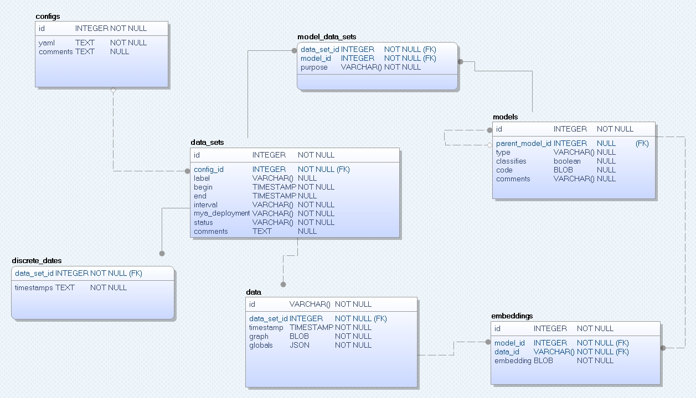

# CEBAF Graph Database

An application consisting of a database to store data sets of CEBAF graph objects and a web interface for locating and
retrieving them.

# Schema 



# Command Line Usage

## Import data to create DataSet

```shell
artisan graph-data:import  ./tests/data/20221221_092324 --comment="First Data Set"
```

## List data sets
```shell
 cebaf-graph-db % sail artisan graph-data:list-sets
+----+-----------------------------+-----------------+
| ID | Created                     | Comment         |
+----+-----------------------------+-----------------+
| 1  | 2023-01-09T19:24:10.000000Z | First data set  |
| 2  | 2023-01-09T19:24:18.000000Z | Second data set |
+----+-----------------------------+-----------------+
```

## Append data to an existing DataSet

```shell
 # The number 2 is the data set id to which data is appended
 artisan graph-data:append 2 ./tests/data/20230109_104207 --label=foo 
```

## Append data to an existing DataSet

```shell
 # The number 2 is the data set id to which data is appended
 # Add --replace to prevent an error if timestamp already occupied
 artisan graph-data:append 2 ./tests/data/20230109_104207 --label=bar --replace
```


